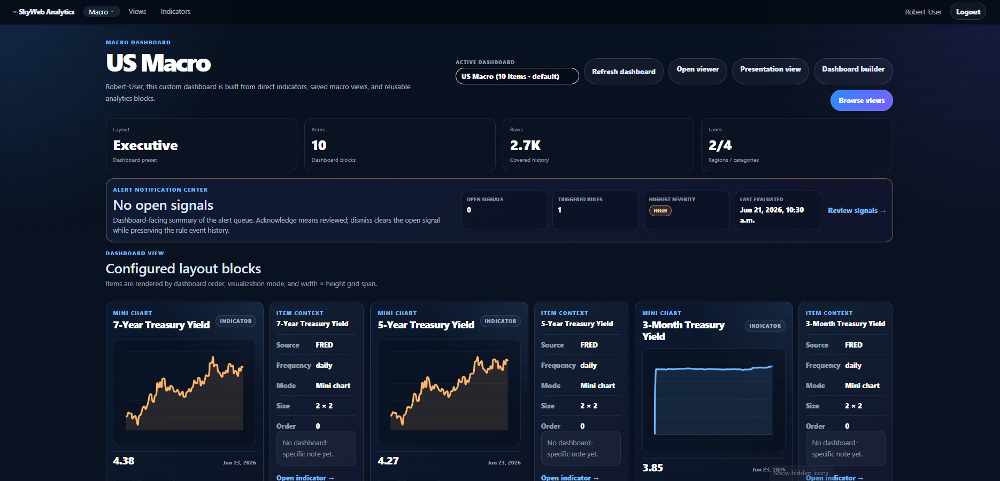
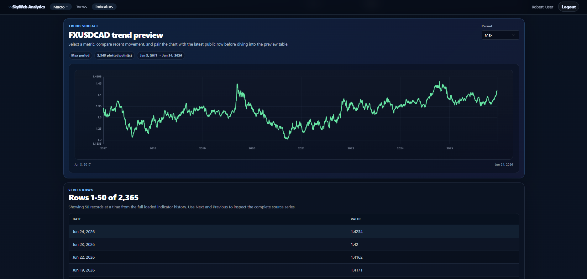
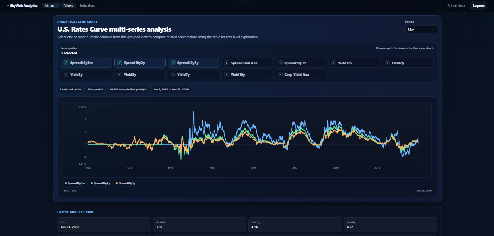
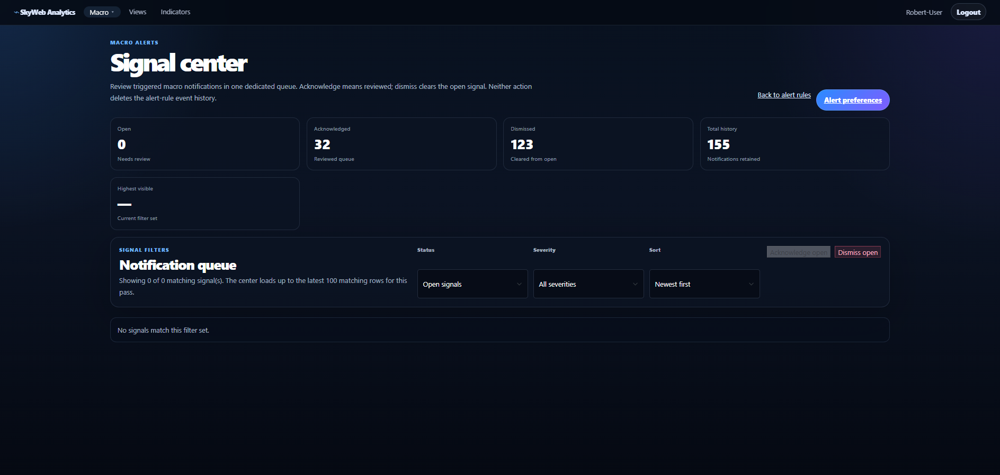
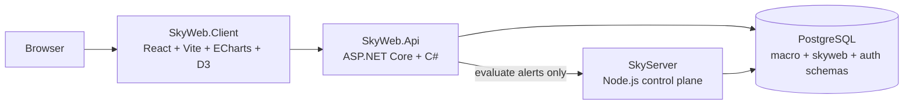

# SkyWeb Analytics

SkyWeb Analytics is a full-stack macroeconomic analytics platform built for exploring indicators, curated macro lenses, authenticated dashboards, alert rules, signal notifications, and professional chart surfaces.

It is the public/member-facing analytics layer of the Sky ecosystem. SkyServer remains the private control plane for ingestion, automation, workers, tooling, repository utilities, and alert evaluation execution.

## Stack at a Glance

| Layer         | Technology                                                                                  |
| ------------- | ------------------------------------------------------------------------------------------- |
| Client        | React, Vite, React Router, Bootstrap, Axios                                                 |
| Charts        | Apache ECharts with D3 helpers                                                              |
| API           | ASP.NET Core Web API, C#                                                                    |
| Data access   | Dapper, Npgsql                                                                              |
| Database      | PostgreSQL                                                                                  |
| Auth          | App-scoped login, opaque bearer sessions, BCrypt validation, SHA-256 session-token hashes   |
| Control plane | SkyServer Node.js / Express / Knex for ingestion, workers, automation, and alert evaluation |

## Screenshots

| Macro Dashboard                                                    | Indicator Alert Overlays                                                             |
| ------------------------------------------------------------------ | ------------------------------------------------------------------------------------ |
|  |  |

| Macro View Detail                                                      | Signal Center                                                  |
| ---------------------------------------------------------------------- | -------------------------------------------------------------- |
|  |  |

Additional screenshots are available in [`docs/assets/screenshots/`](docs/assets/screenshots/), including the macro overview, alert rules, dashboard builder, account preferences, alert preferences, chart tooltip, and presentation-mode views.

## What This Project Demonstrates

- **React + ASP.NET Core full-stack architecture** with a dedicated C# analytics API.
- **PostgreSQL-backed macro data exploration** across public indicators and curated multi-series macro views.
- **Authenticated member workflows** for profiles, preferences, saved views, dashboards, alert rules, and signal notifications.
- **Professional charting with ECharts/D3**, including dense time-series charts, tooltips, adaptive axes, threshold overlays, and optional alert-event markers.
- **Safe migration discipline**, moving route families from a Node-backed prototype path into native C# services with validation and cutover cleanup.
- **Clear system boundaries**, with SkyWeb focused on analytics/product presentation and SkyServer focused on operational control-plane work.

## Product Surfaces

| Surface               | Purpose                                                                                     |
| --------------------- | ------------------------------------------------------------------------------------------- |
| Macro Overview        | Public macro entry point with curated economic context                                      |
| Macro Dashboard       | Authenticated cockpit with dashboard blocks, charts, saved content, and alert summary       |
| Macro Views           | Curated multi-indicator lenses such as rates, inflation, labor, FX, and macro regime views  |
| Indicator Details     | Single-indicator drilldown with ECharts chart, time-series table, and alert overlays        |
| Dashboard Builder     | Member dashboard creation with saved-view and direct-indicator cards                        |
| Alert Rules           | Threshold watches with severity, status, history, clone/edit/delete, and evaluate-now flows |
| Signal Center         | Alert-notification lifecycle for open, acknowledged, dismissed, and historical signals      |
| Account + Preferences | Authenticated profile, dashboard preferences, and alert-surfacing preferences               |

## Architecture



Current request flow:

```text
SkyWeb.Client
  → SkyWeb.Api
      → native C# public macro endpoints
      → native C# auth/session endpoints
      → native C# profile, preference, saved-view, dashboard, alert-rule, alert-notification, and Signal Center endpoints
      → proxy to SkyServer Node API for evaluate-now alert execution only
```

Alert evaluation remains intentionally SkyServer-owned because SkyServer owns ingestion, workers, scheduler/listener behavior, automation, and control-plane execution.

## Current Status

**Active phase:** Phase 9.4 — Career / Interview Proof Assets

The .NET transition is complete. DN-10 promoted the ASP.NET Core/C# lane as the default SkyWeb development and build path, and DN-10.1 removed the retired React-only client. Recovery for the retired client is through Git history or an earlier repo archive, not through an active source folder.

Primary implementation path:

```text
apps/web-dotnet/SkyWeb.Client  React / Vite / Apache ECharts / D3
apps/web-dotnet/SkyWeb.Api     ASP.NET Core / C# / Dapper / PostgreSQL
```

Default npm scripts use the active SkyWeb client:

```text
npm run web      -> apps/web-dotnet/SkyWeb.Client
npm run build    -> apps/web-dotnet/SkyWeb.Client production build
npm run preview  -> apps/web-dotnet/SkyWeb.Client preview
```

## Local Development

Install JavaScript dependencies from the repository root:

```bash
npm install
```

Run these in separate terminals:

```bash
# Terminal 1 — SkyServer Node API / control plane
cd ../SkyServer
npm run api
```

```bash
# Terminal 2 — SkyWeb ASP.NET Core API
cd ../SkyWeb
npm run dotnet:api
```

```bash
# Terminal 3 — SkyWeb Analytics client
cd ../SkyWeb
npm run web
```

Open:

```text
http://localhost:5175
```

Useful validation/build commands:

```bash
npm run dotnet:prep
npm run dotnet:build
npm run build
npm run lint
```

## Environment

Create `.env.local` from `.env.example` when needed:

```bash
cp .env.example .env.local
```

Active client variables:

```text
VITE_SKYWEB_API_BASE_URL=/api
VITE_SKYWEB_API_ORIGIN=http://localhost:7280
VITE_SKYSERVER_API_BASE_URL=/api
VITE_SKYSERVER_API_ORIGIN=http://localhost:7171
VITE_MACRO_API_PREFIX=/public/macro
VITE_SKYWEB_AUTH_APP_CODE=SKYWEB
VITE_SKYWEB_SESSION_TOKEN_KEY=skyweb.sessionToken
VITE_SKYWEB_PUBLIC_MODE=true
VITE_API_TIMEOUT_MS=20000
```

The .NET API connection string is configured in:

```text
apps/web-dotnet/SkyWeb.Api/appsettings.Development.json
```

Use .NET user secrets for local database passwords instead of committing real credentials.

## Primary Local URLs

| Surface                 | URL                                |
| ----------------------- | ---------------------------------- |
| SkyWeb Analytics client | `http://localhost:5175`            |
| SkyServer Node API      | `http://localhost:7171`            |
| SkyWeb.Api health       | `http://localhost:7280/_health`    |
| SkyWeb.Api DB health    | `http://localhost:7280/_db/health` |
| SkyWeb.Api Swagger      | `http://localhost:7280/swagger`    |

## Repository Layout

```text
SkyWeb/
├── apps/
│   └── web-dotnet/
│       ├── SkyWeb.DotNet.sln
│       ├── SkyWeb.Api/      # ASP.NET Core / C# API
│       └── SkyWeb.Client/   # React / Vite client backed by SkyWeb.Api
├── docs/
│   ├── assets/screenshots/  # Portfolio screenshots
│   └── *.md                 # Portfolio, feature-tour, roadmap, and repo-map docs
├── .env.example
└── package.json
```

Build artifacts such as `bin/`, `obj/`, `dist/`, and `node_modules/` should not be included in generated repo zips.

## Portfolio Docs

| Asset                                                                                | Purpose                                                                                 |
| ------------------------------------------------------------------------------------ | --------------------------------------------------------------------------------------- |
| [`docs/SkyWeb_Portfolio_Brief.md`](docs/SkyWeb_Portfolio_Brief.md)                   | Concise product story, technical proof points, and interview-ready summary              |
| [`docs/SkyWeb_Feature_Tour.md`](docs/SkyWeb_Feature_Tour.md)                         | Guided product walkthrough and screenshot sequence                                      |
| [`docs/SkyWeb_Interview_Talking_Points.md`](docs/SkyWeb_Interview_Talking_Points.md) | Interview-ready explanations for architecture, migration, alerts, charts, and tradeoffs |
| [`docs/SkyWeb_Architecture_Decisions.md`](docs/SkyWeb_Architecture_Decisions.md)     | ADR-style notes explaining major engineering decisions and consequences                 |
| [`docs/SkyWeb_Resume_Bullets.md`](docs/SkyWeb_Resume_Bullets.md)                     | Resume, LinkedIn, ATS keyword, and role-specific project bullet source material         |
| [`docs/SkyWeb_Recruiter_Brief.md`](docs/SkyWeb_Recruiter_Brief.md)                   | Short recruiter-friendly summaries and role-specific positioning                        |
| [`docs/SkyWeb_Demo_QA.md`](docs/SkyWeb_Demo_QA.md)                                   | Demo walkthrough Q&A, STAR prompts, and technical interview answers                     |
| [`docs/SkyWeb_Phase_9_Roadmap.md`](docs/SkyWeb_Phase_9_Roadmap.md)                   | Phase 9 execution plan and remaining polish slices                                      |
| [`docs/SkyWeb_Visual_Asset_Manifest.md`](docs/SkyWeb_Visual_Asset_Manifest.md)       | Canonical screenshot inventory and README usage notes                                   |
| [`docs/assets/screenshots/README.md`](docs/assets/screenshots/README.md)             | Screenshot folder notes and file inventory                                              |

## Relationship to SkyServer

SkyWeb Analytics should not duplicate SkyServer Admin features. SkyServer owns:

- Tool execution
- Ingestion management
- Worker automation
- Access control administration
- Audit reporting
- Repository/system configuration
- Application membership management
- Future Temporal workflow orchestration
- Current alert evaluation execution

SkyWeb Analytics consumes curated APIs and focuses on public presentation, exploration, member personalization, dashboards, alerts, and chart intelligence.
